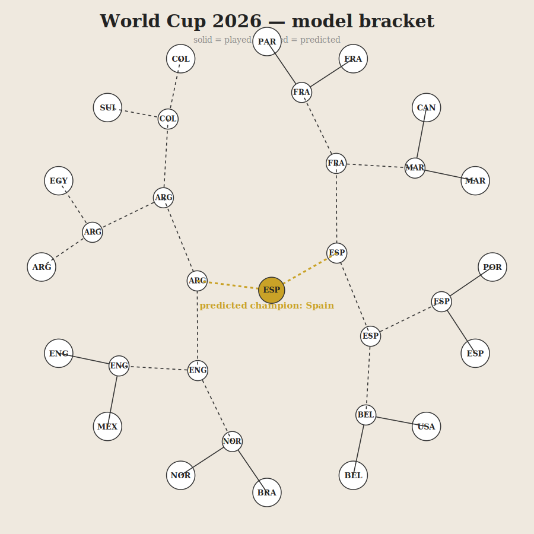

# I tried to predict the World Cup. The interesting part was where it stopped working.

Everyone builds a World Cup predictor. They pick a champion, post it, and move on. It is easy, and it is mostly a lie.

I wanted the honest version. Build the best predictor I can. Push it until it stops getting better. Then look hard at the exact spot where it stopped.

Because that spot tells you something real. It tells you where football stops being about who is the better team, and starts being about luck.

This is the whole thing. Every model I used. Every number I fed it. Every weight I picked. What worked, what embarrassed me, and where the wall is.

It is long. That is on purpose.

## The whole model is one question

The model asks one thing, over and over. Who is better right now, and by how much?

That is it. Everything below is me arguing with myself about how to measure "better." And being honest about the moments when knowing who is better is still not enough to know who wins.

I keep three questions separate the whole way through, because they are not equally answerable:

Who wins a single match. Who wins a group. Who advances through the knockouts.

The first is the hardest. One match is where luck lives. The last two are easier, because they add up several matches and luck starts to cancel out. Hold on to that idea. It comes back.

## First I built a memory

You cannot predict anything without a memory. So I built one.

I took every international match ever recorded. From 1872 to today. That is 49,503 games. Who played, the score, the competition, and whether it was on neutral ground.

This is the backbone. It is where raw team strength comes from. And it already holds the games that matter: the last African Cup of Nations, Euro 2024, the Nations League, Copa América, every World Cup qualifier. 4,666 competitive games since 2022 alone.

Then I added a few more things.

Current strength ratings for all 244 countries, pulled from a public Elo site. Ratings for 464 clubs, so I could measure how good a squad is from where its players play their club football. The official squad lists, 1,248 players. And the big one for later: expected goals for all 94 World Cup matches played so far.

One boring but honest note. The Python I was running had a broken security stack that crashed on every web request. So I pulled some of this through PowerShell instead. Real data work is thirty percent plumbing.

## The rating

The strength backbone is an Elo rating. It is the same idea as chess ranking.

Every team starts at 1500 points. You beat someone, you take points off them. Beat a team far above you, you take a lot. Beat a minnow, you take almost nothing. Lose, and you hand points over the same way.

The math is one line. The chance team A wins is:

```
1 / (1 + 10^((rating_B − rating_A) / 400))
```

After the match you move the rating by `K × (what happened − what was expected)`. `K` is how big the swing is.

Here is the part people get lazy about. Not every match should count the same. A friendly is not a knockout final. Teams rest players in friendlies. They experiment. They do not care. So I set `K` by how much the game mattered:

```
World Cup final game        55
Euro / Copa / AFCON final    45
Nations League, qualifiers   35
other competitive            25
friendly                     15
```

I also made a bigger scoreline count for more. A 4-0 says more than a 1-0.

That Nations League line actually mattered. In my first version those games fell into the "other" bucket and got under-counted. That quietly threw away 600 recent, serious matches. Fixing it made the ratings sharper.

## The first model, and the wall

On top of the rating I built a small predictor. It looks at the rating gap and recent form and spits out three numbers. Chance of a win, a draw, a loss. It picks the biggest.

I trained it, then replayed all 72 group matches it had never seen, and made it call every one.

It got 64 percent right.

Then I threw everything at it. More features. More data. Cleverer math.

It stayed at 64 percent.

So I stopped and looked at the games it got wrong. Almost all of them were draws.

Here is the problem with a draw. Of those 72 group games, 20 ended level. More than one in four. And on those exact 20 games, the model's average guess for "draw" was 17 percent. It was busy backing a winner at 66 percent.

The model was not broken. Draws are just close to random.

Think about why. When two even teams play, a draw is the single most likely result. But the model almost never picks it. Why? Because the two teams keep splitting the odds between them. Team A gets 40, team B gets 40, the draw gets 20. The draw never wins the vote, even when it is the smart bet.

You cannot know in advance which even game ends level. It comes down to a deflection. A flag. A keeper having a good day.

Is 64 percent even good? Yes. Bookmakers, with billions of dollars on the line, land around 53 to 55 percent on match results. So 64 is strong.

Which means something. Anyone who shows you a model that is "92 percent accurate at picking match winners" is either fooling themselves or feeding it the answer. I will prove that at the end by doing it on purpose.

So I stopped trying to win every match. I asked a question that can actually be answered.

## Who wins the group

One match is a weighted coin. But who wins a group of four teams is three matches. Luck starts to cancel. A strong team can draw one game and still finish top.

And here football humbled me.

I had built this whole machine-learning thing. Out of curiosity I tried the dumbest possible version. Rank each group by one number, the current strength rating. Call the top team the winner. No learning. No features. One column, sorted.

It got 11 of 12 group winners.

My clever model did not beat it.

That is a lesson you only learn by measuring. When your one-line shortcut matches your fancy model, the shortcut is the real story. For "who is the better team," a good rating already knows almost everything. The machine learning was just decorating a signal that was already there.

The one group the rating missed was Group D. It said Turkey. The USA won it. And the reason it missed is the next piece.

## There is no home team, but there is a home

A World Cup has no home team. Every game is at a neutral stadium. My first model did not know that. It was secretly giving a bonus to whichever team got listed first in the fixture. That is not home advantage. That is alphabetical luck.

So I fixed it. I made the model symmetric. Swap the two teams, and the only thing that changes is which win probability is which. The draw does not move.

But then I noticed something. 2026 is hosted by the USA, Canada, and Mexico. So "neutral" is not the same for everyone.

Mexico playing in Guadalajara has 80,000 screaming fans. No jet lag. Familiar heat. Australia playing in New York flew 15,000 kilometers into a strange time zone to play in front of no one. Calling those two the same is silly.

So I made home advantage a dimmer, not a switch. Full bonus in your own country. A slice of it for everyone else, and the slice shrinks with how far they had to travel:

```
home bonus = 95 points          if it is your own country
           = 95 × exp(−distance / 3000 km)   otherwise
```

I looked up the coordinates of all 16 host cities and all 48 countries and measured the real distance. Here is what came out, in rating points:

```
USA, Canada, Mexico (home)     95
Mexico (across its venues)     ~80
Haiti, Colombia, Panama        27 to 44
Brazil, England, Morocco       12 to 14
Argentina 5   Japan 3   Australia 1
```

I did not tune those. That is just geography. Nearby teams with big travelling crowds get a real push. Teams flown in from the other side of the planet get almost nothing.

Add the dimmer back in, and the USA edge past Turkey.

Now the rating calls all 12 group winners. All of them. The only thing between a good rating and a perfect dozen was remembering who is playing at home.

## A better model: count the goals

Picking win, draw, or loss is crude. What I really want is to guess how many goals each team scores. Because if I can do that, draws fall out on their own, and I can simulate whole scorelines.

So I switched to counting goals.

Every team gets an attack number and a defence number. The goals a team is expected to score is:

```
expected goals = exp( base + your attack − their defence + home )
```

Then I treat goals like a Poisson process. That is just the math for "rare events that happen at some average rate." If a team is expected to score 1.6, this gives me the chance they score exactly 0, exactly 1, exactly 2, and so on. Do that for both teams, multiply, and I have the chance of every final score. Add up the scores where team A wins, where it is level, where team B wins. Now the draw is a real number the model computes, instead of a thing it ignores.

I found the attack and defence numbers by trial and improvement. Start everyone at zero. Guess the goals. Compare to what really happened. Nudge each team's numbers toward the truth. Do it a few hundred times until it settles. The nudge is simple: expected goals minus real goals.

Two things I weighted on purpose here.

Recent games count more. A match from six years ago should not weigh as much as one from this year. So each game's weight halves every two and a half years.

And I mixed in that current national rating. The from-scratch attack and defence is shaky for teams that rarely play the big nations. So I pull each team's expected goals toward the rating gap between them. This one blend does a lot of work. On its own, the raw goals model got 7 of 12 group winners. With the rating mixed in, it jumped to 11 or 12.

The rating is the engine. The goals model is the car built around it.

## Using the group stage: how they played, not just who won

When the group stage finished, I had new information. The lazy move is to just read the table. Points and goal difference. But the table throws away most of what happened. I graded each result four ways.

Who they played. This one is free, because the rating already handles it. Drawing Brazil pushes you up. Beating a minnow does not. Morocco drew Brazil in their first game, and the rating knew that was a strong result even though it was only a draw.

When they played their good games. A team that loses its first match and wins the next two is rounding into form. That is more dangerous than a team that started hot and faded. So I weighted the three group games by when they happened: first game 0.6, second game 1.0, third game 1.6. A bad opener hurts less. A strong finish counts more. Paraguay got hammered 1-4, but that was their first game, so it got discounted.

How they lost. Losing to a goal in the 93rd minute means you were level for 92 minutes. You played fine. So I read the goal times out of the data and worked out the score as it stood at the 85th minute. Then I mixed that with the final score, 65 percent final, 35 percent the 85th-minute version. A late heartbreak and a proper beating no longer count the same.

By how much. A three-goal win counts a little more than a one-goal win.

All of these went into how much a group result moved a team's rating. And I want to be clear about one thing. I set every one of those weights by thinking about football. Not by tuning them until the score looked good. That difference is the whole game, and I hit it again at the end.

## The best thing I added: expected goals

A scoreline lies.

A team can dominate, hit the post four times, and lose to one deflection. Another can get battered and steal a 1-0. If you rate teams on results, you are rating them partly on luck.

Expected goals fixes this. Written xG. It asks a simple question. Given the quality of the chances a team actually created, how many goals should they have scored?

It is the closest thing football has to measuring who deserved to win. I scraped it for all 94 matches.

Here is how I used it. For each game I worked out who deserved to win from the xG alone, then mixed it with the result. 55 percent xG, 45 percent what actually happened. The xG gets the bigger vote, because it is steadier and it predicts the next game better than the score does.

And it immediately told me things the table was hiding:

```
             goals      xG        what it means
Egypt        +2         −0.8      flattered. worse than they looked.
Norway       +1         +2.4      underrated. better than they looked.
Morocco      +3         +3.1      fully deserved. genuinely strong.
Paraguay     −2         −3.0      genuinely poor.
```

Egypt got results but their underlying numbers were negative. They had been a little lucky. Norway looked ordinary on paper but were creating far more than they scored.

Here is the payoff. When Norway later knocked Brazil out, the xG was not surprised. It had been quietly telling me Norway were underrated the whole time.

I also added one more thing. Squad quality. How good are these players, ignoring one noisy group? I looked up every player's club, checked how strong that club is, and averaged it out. A team built from top clubs is strong even if it stumbled for three games. I kept this small, because matching player names to clubs is messy.

## How I checked it was not lying to me

The number I trust most does not come from the World Cup at all.

I trained the model only on matches before 2024. Then I tested it on 2024 and 2025 games it had never seen. It landed around 60 to 62 percent. That is the honest "how good is the engine" number. It cannot be gamed. And every World Cup result I report sits in that same neighbourhood, instead of magically higher. If a step had suddenly claimed 85 percent, I would have gone hunting for the leak.

## Then I predicted the knockouts blind

This is where it got fun. Now I could test against a real future.

I froze the model's knowledge at the end of the group stage. Then I made it predict the whole knockout bracket. Round of 32 all the way to the final. Without looking at a single knockout result.

Round of 32: 14 of 16 correct.

Look at the two it missed. Germany lost to Paraguay. The Netherlands lost to Morocco. Both went to penalty shootouts.

A shootout is a coin flip that happens to involve feet. No model on Earth should claim to call one. Of the 14 games decided in normal time by the better team, I got all 14.

That is not luck. That is the ceiling. And the ceiling is honest.

The xG earned its keep here too. Remember Netherlands against Morocco. Morocco actually outplayed them, 1.38 xG to 0.24, while winning on penalties. The model saw the performance, not the shootout. It rated Morocco up. Then it correctly picked them to beat Canada in the next round.

## Rolling it forward

As the tournament moved, I moved with it.

Use everything through the Round of 32. Predict the Round of 16 blind. Then use everything through the Round of 16, and predict the rest.

```
groups        →  Round of 32:   14 / 16
Round of 32   →  Round of 16:    5 / 6
-----------------------------------------
all together:                   19 / 22   =   86 percent
```

Three misses across the entire knockout stage. Two penalty shootouts, and one honest upset, Norway beating Brazil in normal time. Everything the better team won on the pitch, I called.

## Where it stands right now

I take everything that has actually happened. Every group game, the Round of 32, and the finished Round of 16. I lock those in as fact. Then I simulate the rest of the bracket 20,000 times.

Here is the full bracket, with the path the model expects through the games still to be played.



*Solid lines are played. Dashed lines are predicted. Gold is the champion.*

```
Spain       34%
France      20%
Argentina   18%
England     13%
Norway       5%
```

Spain sit clear on top. Not because of their results. Because of their xG, which was the best in the tournament. The single most likely path has Spain beating Argentina in the final.

## The two ways to fake a perfect model

I promised I would show you the cheating. So I ran both tricks on my own model.

The first is overfitting. Give a model far more knobs than it needs, and let it memorize the training games. I did it on purpose. Its score on games it had already seen climbed toward the sky. Its score on new games got worse. It was not learning. It was memorizing noise and calling it skill. The tell is simple. If someone only ever tests their model on the same data they trained it on, this is what is happening.

The second is leakage. Sneak the answer into the question. I added one input, the final goal difference of the match, and asked it to "predict" the result.

100 percent accurate.

Of course it was. I told it the score.

Every "100 percent accurate" model has an input like this hiding in it. Final possession. Post-match ratings. The closing betting odds. Something that already contains the answer. When you see a perfect model, go find which input is the answer wearing a fake moustache.

This is also why I set my weights by thinking, not by tuning them until the backtest looked good. On a sample this small, tuning to the score is just leakage with extra steps.

## Where the wall is

I never wanted a crystal ball. I wanted something honest enough that every guess comes with a reason. And I wanted to find the exact line where the reasons run out.

That line turned out to be a beautiful thing.

I can call all 12 group winners. I can call 86 percent of knockout games one round ahead. But I cannot call a penalty shootout, and I cannot beat 64 percent on a single match.

Because past that line, football stops being about who is better. It starts being about a ball hitting the inside of a post and bouncing the wrong way.

A model that knows where its own line is, one that tells you "Spain, 34 percent, here is exactly why, and no I cannot promise it," is worth ten models that shout a confident winner and quietly leak the score.

---

*All of this runs on plain Python. The ratings come from 49,503 international matches and current national numbers. The xG for all 94 World Cup games came from Sofascore. The code, the data, and the full scoreboard are in this repo.*
